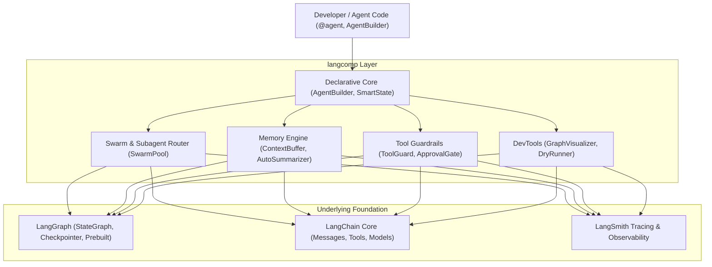

# Chapter 00: Overview & Architecture

## 💡 Why `langcomp`?

The LangChain ecosystem—including **LangChain**, **LangGraph**, and **DeepAgents**—provides powerful infrastructure for stateful agent orchestration. However, developers and AI coding agents frequently encounter friction in routine engineering tasks:

1. **Graph Boilerplate Ceremony:** Constructing a basic agent loop in LangGraph requires writing `TypedDict` state schemas, manual reducer annotations (`Annotated[list, add_messages]`), `StateGraph` instantiation, node registration, and edge routing.
2. **Subagent Delegation Complexity:** Implementing multi-agent subagent patterns requires manual subgraph management or complex `Command` routing to prevent context bloat.
3. **Context Window Overflow:** Managing long conversations requires writing custom graph reducers or manual message-trimming nodes.
4. **Tool Reliability & Error Handling:** Flaky tool API calls or schema errors cause graph execution crashes unless wrapped in custom node error handlers.
5. **Local Debugging & Unit Testing:** Inspecting graph topologies and unit testing individual node transitions without invoking paid cloud services (e.g. LangSmith) can be tedious.

**`langcomp`** addresses these pain points by offering a lightweight, high-level complementary layer on top of `langgraph` and `langchain-core`.

---

## 🏗️ Architectural Positioning

`langcomp` does **not** replace LangGraph or LangChain—it complements them. Every agent created with `langcomp` compiles into a native `langgraph.graph.CompiledGraph` object.

> [!NOTE]
> Because `langcomp` compiles down to native LangGraph objects, you retain 100% compatibility with LangGraph checkpointers, streaming features, and LangSmith tracing.

---

## 🔑 Core Design Principles

1. **Zero-Ceremony Decorators:** Define agents, nodes, and state schemas with intuitive Pythonic builders (`AgentBuilder`, `@agent`).
2. **Context Isolation by Default:** Subagents execute in isolated memory spaces to preserve prompt context in supervisor loops.
3. **Resilient Execution:** Wrap tools with automatic retries, fallback responses, and Human-in-the-Loop approval gates.
4. **Offline First:** Visualize topologies and dry-run state mutations locally without external dependencies.
