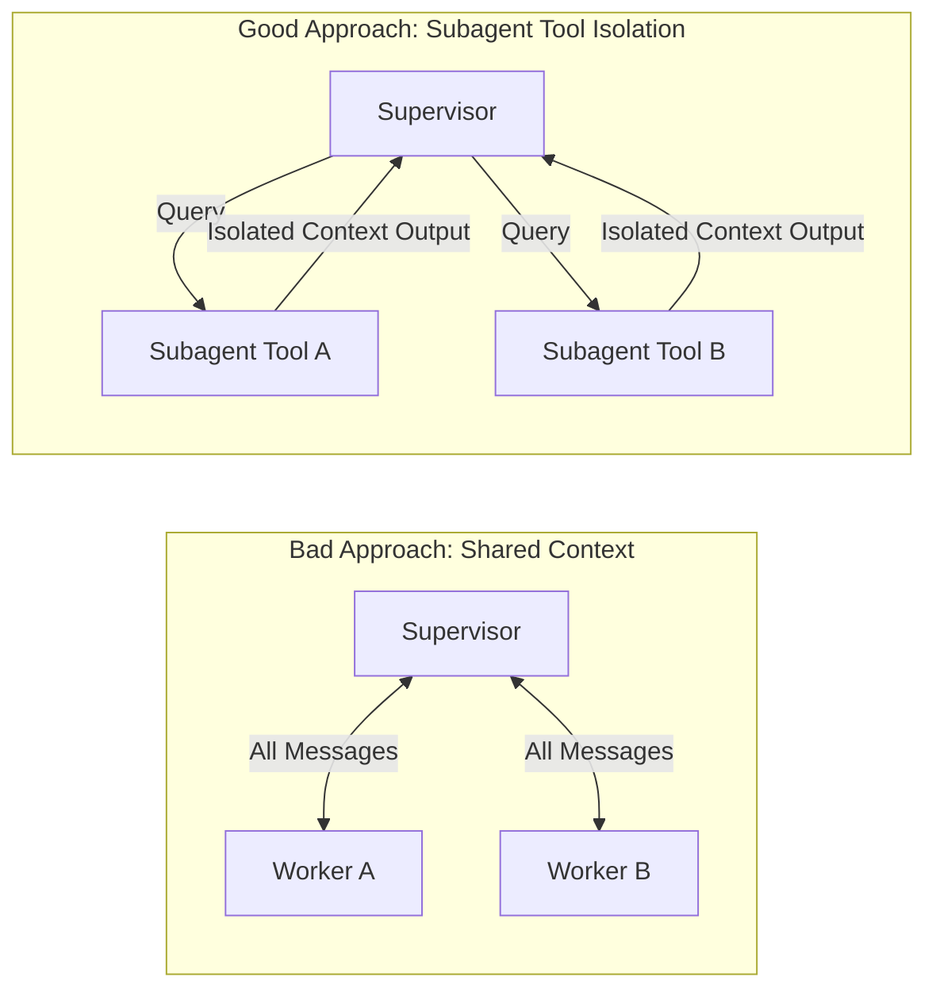

# Chapter 02: Multi-Agent Swarms & Subagent Delegation

In this chapter, you will learn how to orchestrate multi-agent swarms using `SwarmPool` and `SubAgent` to achieve clean context isolation.

---

## 🎯 The Context Bloat Problem

In complex multi-agent applications, passing all messages between supervisor and worker agents can quickly exhaust the LLM's context window.



`langcomp.swarm` solves this by converting subagents into context-isolated tools that can be registered in a pool and called dynamically.

---

## 🐝 1. Registering Subagents with `SwarmPool`

`SwarmPool` manages registered subagents and exposes their capabilities as standard LangChain tools.

```python
from langchain_core.messages import AIMessage
from langcomp import AgentBuilder, SwarmPool

# 1. Define specialized worker agents
def researcher_logic(state):
    query = state["messages"][-1].content
    return {"messages": [AIMessage(content=f"Research Findings for '{query}': Found 3 key papers.")]}

def coder_logic(state):
    query = state["messages"][-1].content
    return {"messages": [AIMessage(content=f"Generated Code for '{query}': def solution(): pass")]}

researcher_agent = AgentBuilder("ResearcherAgent").add_node("res", researcher_logic).compile()
coder_agent = AgentBuilder("CoderAgent").add_node("code", coder_logic).compile()

# 2. Instantiate SwarmPool and register subagents
pool = SwarmPool("DevTeamSwarm")

pool.register(
    name="researcher",
    description="Specialized in technical research and paper summaries",
    agent_or_callable=researcher_agent,
    capabilities=["search", "documentation"],
)

pool.register(
    name="programmer",
    description="Specialized in writing and debugging Python code",
    agent_or_callable=coder_agent,
    capabilities=["python", "coding"],
)
```

---

## 🛠️ 2. Exporting Subagent Tools for Supervisor Agents

To let a main supervisor agent invoke subagents dynamically, retrieve tools from the pool:

```python
# Convert all subagents into standard LangChain tools
tools = pool.get_tools()

for t in tools:
    print(f"Tool Name: {t.name}")
    print(f"Description: {t.description}\n")
```

### Invoking a Subagent Tool

```python
research_tool = tools[0]

# Execute subagent tool with task description
result = research_tool.invoke({"task_description": "Summarize attention mechanism in Transformers"})
print(result)
# Output: Research Findings for 'Summarize attention mechanism in Transformers': Found 3 key papers.
```

---

## 💡 Best Practices for Swarms

> [!TIP]
> 1. **Clear Descriptions:** Always provide clear, precise descriptions when registering subagents so supervisor models know exactly when to route tasks to them.
> 2. **Capability Tagging:** Use `capabilities=["tag1", "tag2"]` to programmatically filter or query subagents from the pool.
> 3. **Isolated Thread IDs:** `SubAgent.run()` automatically scopes thread IDs (`subagent_{name}`), keeping conversation history isolated per worker.
