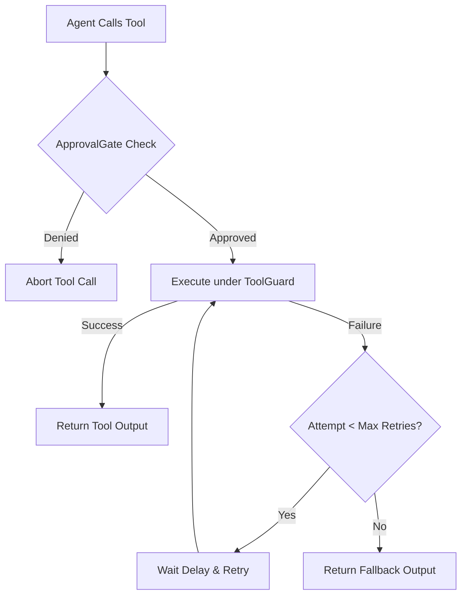

# Chapter 04: Tool Guards & Human Approval Gates

In this chapter, you will learn how to make tool execution resilient against external failures using `ToolGuard`, and how to enforce security policies using `ApprovalGate`.

---

## 🛡️ 1. Guarding Unstable Tools with `ToolGuard`

External tools (web search APIs, database connections, remote microservices) frequently fail due to rate limits or network glitches. `ToolGuard` automatically wraps tool functions with retry policies, delay intervals, and fallback outputs.

```python
import random
from langcomp import ToolGuard

# Simulate an unstable tool function
attempt_count = 0

def fetch_stock_price(symbol: str) -> str:
    global attempt_count
    attempt_count += 1
    print(f"Attempt #{attempt_count} fetching price for {symbol}...")
    if attempt_count < 3:
        raise ConnectionError("Temporary network timeout")
    return f"Stock {symbol}: $150.25"

# Wrap tool with 3 retries and fallback
guard = ToolGuard(
    max_retries=3,
    retry_delay_seconds=0.2,
    fallback_output="Service currently unavailable."
)

guarded_tool = guard.wrap_function(fetch_stock_price)

# Execute tool
result = guarded_tool("AAPL")
print(f"Final Result: {result}")
```

### Wrapping LangChain `BaseTool` Instances

```python
from langchain_core.tools import tool

@tool
def calculate_tax(amount: float) -> float:
    """Calculate tax for given amount."""
    return amount * 0.15

# Wrap LangChain BaseTool directly
guarded_tax_tool = guard.wrap_tool(calculate_tax)
```

---

## 🚦 2. Human-In-The-Loop Gates with `ApprovalGate`

Sensitive agent actions (e.g. sending emails, executing SQL modifications, making financial transactions) require human approval before execution.

`ApprovalGate` provides a clean callback hook to inspect actions and parameters before execution.

```python
from langcomp import ApprovalGate

# Define custom approval logic
def security_policy_callback(action_name: str, parameters: dict) -> bool:
    print(f"\n[APPROVAL GATE NEEDED] Action: '{action_name}', Parameters: {parameters}")
    
    # Policy rule: block any operation targeting production environments
    env = parameters.get("environment", "development")
    if env == "production":
        print("--> DENIED: Production actions require administrator authorization!")
        return False
        
    print("--> APPROVED: Non-production action allowed.")
    return True

gate = ApprovalGate(approval_func=security_policy_callback)

# Test action approval check
dev_action = {"action": "restart_service", "environment": "development"}
prod_action = {"action": "drop_table", "environment": "production"}

if gate.check_approval("service_manager", dev_action):
    print("Executing dev action...")

if not gate.check_approval("database_manager", prod_action):
    print("Prod action aborted safely!")
```

---

## 📌 Guardrails & Safety Summary


