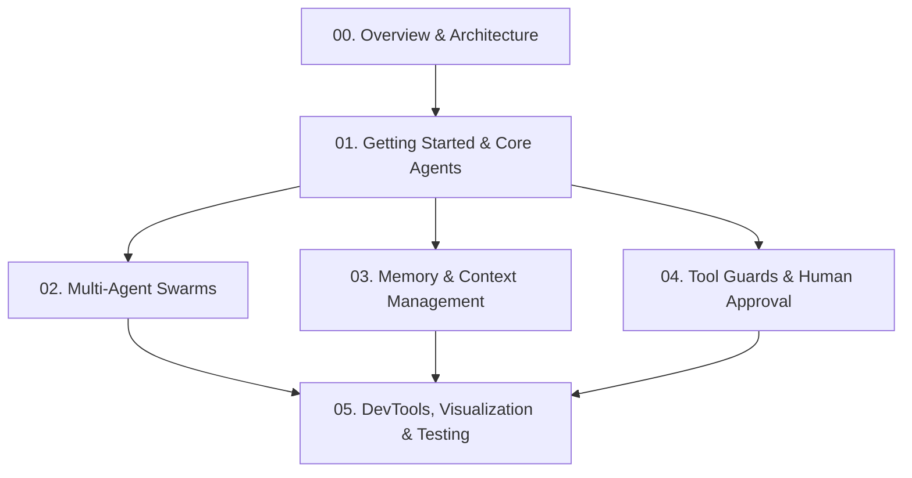

# `langcomp` Comprehensive Tutorial Suite

Welcome to the official, step-by-step tutorial suite for **`langcomp` (LangChain-Complementary)** — the high-level, developer-friendly framework designed to streamline and complement [LangChain](https://docs.langchain.com), [LangGraph](https://docs.langchain.com/oss/python/langgraph/overview), and [DeepAgents](https://docs.langchain.com/oss/python/deepagents/overview).

---

## 🎯 Learning Path Overview

This tutorial suite is organized into modular, progressive chapters. Each chapter focuses on a specific aspect of building robust, stateful AI agents and multi-agent swarms.



---

## 📚 Chapters Table of Contents

| Chapter | Title | Topics Covered |
| :--- | :--- | :--- |
| **[Chapter 00](00_overview_and_architecture.md)** | **Overview & Architecture** | Ecosystem pain points, `langcomp` positioning, core design principles |
| **[Chapter 01](01_getting_started.md)** | **Getting Started & Core Agents** | Installation, `AgentBuilder`, `@agent` decorator, `SmartState` |
| **[Chapter 02](02_multi_agent_swarms.md)** | **Multi-Agent Swarms** | `SwarmPool`, `SubAgent` context isolation, supervisor delegation tools |
| **[Chapter 03](03_memory_and_context.md)** | **Memory & Context Engine** | `ContextBuffer` sliding window, `AutoSummarizer` background summary |
| **[Chapter 04](04_tool_guards_and_approval.md)** | **Tool Guards & Approval Gates** | `ToolGuard` retries/fallbacks, `ApprovalGate` Human-In-The-Loop |
| **[Chapter 05](05_devtools_and_testing.md)** | **DevTools & Testing** | `GraphVisualizer` (ASCII/Mermaid), `DryRunner`, offline unit testing |

---

## 🚀 Prerequisites

- Python 3.10 or higher
- Basic understanding of LLM agent concepts (prompts, tools, state)
- Familiarity with standard Python virtual environments (`venv`, `conda`, `uv`)

---

## 🛠️ Quick Installation

```bash
git clone https://github.com/ar-sdadras/langchain-complementary.git
cd langchain-complementary
pip install -e .
```
